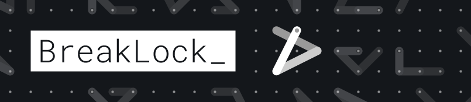

# Breaklock Extension

====

Silly HTML5 game, mobile first.
BreakLock is a hybrid of Mastermind and the Android pattern lock. A game you gonna love to hate.

## Build

## Build

1. Clone the repository
2. Run `npm install` to install node dependencies
3. Run `npm run build` to build the extension
4. Copy the `dist` folder into EXT
